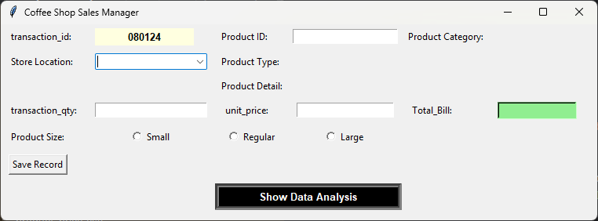

# Introduction
This project analyzes the coffee shop sales in the year 2023 with 3 different store locations. The dataset was sourced from Kaggle (https://www.kaggle.com/datasets/divu2001/coffee-shop-sales-analysis?resource=download). 

The objective of this project is to use LLM(Large Language Models) to have an AI-assisted coding to excute the data analysis and to identify the top selling product and top sales store. The analysis will also help to identify the problem per store locations and may use the strategy of top store to enhance or boost the sales of the other stores.

# Tools Used
- **Python (Pandas, Tkinter, Matplotlib, Numpy):** Data manipulation, data entry application, and data visualization.
- **Pycharm:** Execution enviroment
- **ChatGPT and Claude:** Large Language Models (LLMs) used to generate python script for the prototype.
- **Git & GitHub:** Employed for version control, collaboration, and sharing the project in a structured and reproducible format.

# Dekstop/System Application Overview
## Data Entry Application for Coffee Shop Sales

Click here to see python script: [Go Down](#data-entry-application)

### System Overview
The system can be use to add new data in the existing database which is collected in the Kaggle-Coffee shop sales. This is a sample system that can be also implemented in any stores or data to avoid adding manually to excel, sql, etc. The user will just put the details and it will automatically store it in the existing database.
-- **Transaction ID-** will generate a **unique** set of **number** and avoid redundancy in the **existing database**.
-- **Store Location-** it has a dropdown wherein all three locations are included.
-- **Product ID-** the **ID number** is the required in the product section. The **product category**, **type** and **detail** will appear once the product ID was inserted *(imagine a menu with existing products in a coffee shop with product ID).*
-- **Transaction Quantity, Unit Price and Total Bill-** quantity of ordered product, unit price (base on the menu) and total bill. The total bill will calculated based on the Transaction Quantity and Unit price inserted by the user. 
-- **Save Record-** to add the data to the existing database.
-- **Show Data Analysis-** will show and pop-up the sales dashboard of the coffeeshop. THe dashboard will use all the existing sales information of the database.


# Data Analysis Application for Coffee Shop Sales

Click here to see python script: [Go Down](#sales-dashboard-application)

### System Overview
This is the Coffee shop sales dashboard. It has 4 KPIs and 3 datagraph (Bar chart, Pie Chart and Trend Line). This is to show the sales in the year 2023 and if there's additional set of data, it will automatically included here in the graph.
-- **Bar chart-** it has 3 dropdown option to show the sales per product hierarchy (category, type, and detail)
-- **Pie chart-** to show the sales difference betweens store locations.
-- **Trend line-** will help to analyze the trend of sales per Month, Days and Hours.

# Analysis Breakdown

### 1.

## Recommendation


# Here's the python script use for this project

## Data Entry Application 
```python
import tkinter as tk
from tkinter import messagebox
from tkinter import ttk
import pandas as pd
from datetime import datetime
import os
import random

file_path = r"C:\Users\Owner\PycharmProjects\PythonProjectDA_Project\.venv\coffeeshopsales.csv"
REQUIRED_COLUMNS = ["transaction_id", "transaction_date", "transaction_time", "store_id", "store_location",
                    "product_id", "transaction_qty", "unit_price", "Total_Bill", "product_category", "product_type",
                    "product_detail", "Size", "Month Name", "Day Name", "Hour", "Month"]

# Ensure CSV file exists with required columns
if not os.path.exists(file_path):                                  #This script will help to
    df_init = pd.DataFrame(columns=REQUIRED_COLUMNS)               #create a new CSV file if
    df_init.to_csv(file_path, index=False)                         #the file is not existing
else:
    try:
        df_test = pd.read_csv(file_path)
        for c in REQUIRED_COLUMNS:
            if c not in df_test.columns:
                df_test[c] = pd.NA #add empty values
        df_test = df_test[REQUIRED_COLUMNS]
        df_test.to_csv(file_path, index=False)
    except Exception:
        df_init = pd.DataFrame(columns=REQUIRED_COLUMNS)
        df_init.to_csv(file_path, index=False)


#Generation of Unique Transaction ID
def generate_unique_transaction_id(file_path, length=6):
    """Generate a unique numeric transaction_id not existing in CSV"""
    try:
        df_existing = pd.read_csv(file_path)
        existing_ids = set(df_existing["transaction_id"].astype(str))
    except Exception:
        existing_ids = set()

    while True:
        new_id = ''.join(random.choices("0123456789", k=length))
        if new_id not in existing_ids:
            return new_id


#Saving record
def save_record():
    transID = transactionID_var.get().strip()
    date_transaction = datetime.today()
    date_only = date_transaction.strftime("%m-%d-%Y")
    time_only = date_transaction.strftime("%H:%M:%S")
    month_name = date_transaction.strftime("%B")
    month_only = date_transaction.strftime("%m")
    day_name = date_transaction.strftime("%A")
    hour = date_transaction.strftime("%H")
    storeLoc = entry_storeLoc.get().strip()
    storeID = selected_storeID.get()
    productID = entry_productID.get().strip()
    qty = entry_qty.get().strip()
    unitprice = entry_unitprice.get().strip()
    TotalBill = total_bill_var.get().replace("$", "").strip()
    productCAT = productCAT_var.get().strip()
    productTYPE = productTYPE_var.get().strip()
    productDETAIL = productDETAIL_var.get().strip()
    size = selected_size.get().strip()

    if not transID or not productID or not qty or not unitprice or not TotalBill or not size:
        messagebox.showerror("Error", "Please fill in all fields")
        return

    try:
        unitp = float(unitprice)
        tbill = float(TotalBill) if TotalBill else 0.0
    except ValueError:
        messagebox.showerror("Error", "Unit price must be numbers.")
        return


    new_record = {
        "transaction_id": transID,
        "transaction_date": date_only,
        "transaction_time": time_only,
        "store_id": storeID,
        "store_location": storeLoc,
        "product_id": productID,
        "transaction_qty": qty,
        "unit_price": unitp,
        "Total_Bill": tbill,
        "product_category": productCAT,
        "product_type": productTYPE,
        "product_detail": productDETAIL,
        "Size": size,
        "Month Name": month_name,
        "Day Name": day_name,
        "Hour": hour,
        "Month": month_only,
    }

    df = pd.read_csv(file_path)
    df = pd.concat([df, pd.DataFrame([new_record])], ignore_index=True)
    df.to_csv(file_path, index=False)

    clear_fields()
    messagebox.showinfo("Saved", f"New record saved to coffeeshopsales.csv.")

    #Generate new transaction_id automatically
    transactionID_var.set(generate_unique_transaction_id(file_path))


#Clear Fields
def clear_fields():
    # Do not clear transaction_id, it will auto-update
    selected_storeLoc.set("")
    entry_productID.delete(0, tk.END)
    entry_qty.delete(0, tk.END)
    entry_unitprice.delete(0, tk.END)
    total_bill_var.set("")
    selected_size.set("Not Defined")


#Build Main Tk Window
root = tk.Tk()
root.title("Coffee Shop Sales Manager")
root.geometry("760x250")

#Transaction ID
tk.Label(root, text="Transaction ID:").grid(row=0, column=0, sticky="w", padx=10, pady=5)
transactionID_var = tk.StringVar()
transactionID_var.set(generate_unique_transaction_id(file_path))  # auto-generate on start
label_transID = tk.Label(root, textvariable=transactionID_var, bg="lightyellow", font=("Arial", 10, "bold"), width=15)
label_transID.grid(row=0, column=1, padx=10, pady=5, sticky="w")

#Product fields
df_product = pd.read_csv("product_ID.csv")
productID_map = {}
for _, row in df_product.iterrows():
    pid = int(row["product_id"])
    productID_map[pid] = {
        "product_category": row["product_category"],
        "product_type": row["product_type"],
        "product_detail": row["product_detail"]
    }

productID_var = tk.StringVar()
tk.Label(root, text="Product ID:").grid(row=0, column=2, padx=5, pady=5, sticky="w")
entry_productID = tk.Entry(root, textvariable=productID_var)
entry_productID.grid(row=0, column=3, padx=5, pady=5, sticky="ew")

productCAT_var = tk.StringVar()
tk.Label(root, text="Product Category:").grid(row=0, column=4, padx=5, pady=5, sticky="w")
label_productCAT = tk.Label(root, textvariable=productCAT_var, bg=root.cget('bg'), anchor="w", width=15)
label_productCAT.grid(row=0, column=5, padx=5, pady=5, sticky="ew")

productTYPE_var = tk.StringVar()
tk.Label(root, text="Product Type:").grid(row=1, column=2, padx=5, pady=5, sticky="w")
label_productTYPE = tk.Label(root, textvariable=productTYPE_var, bg=root.cget('bg'), anchor="w")
label_productTYPE.grid(row=1, column=3, padx=5, pady=5, sticky="ew")

productDETAIL_var = tk.StringVar()
tk.Label(root, text="Product Detail:").grid(row=2, column=2, padx=5, pady=5, sticky="w")
label_productDETAIL = tk.Label(root, textvariable=productDETAIL_var, bg=root.cget('bg'), anchor="w")
label_productDETAIL.grid(row=2, column=3, padx=5, pady=5, sticky="ew")


def on_productID(*args):
    pid_text = productID_var.get().strip()
    if not pid_text:
        productCAT_var.set("")
        productTYPE_var.set("")
        productDETAIL_var.set("")
        return
    try:
        pid = int(pid_text)
        info = productID_map.get(pid)
        if info:
            productCAT_var.set(info["product_category"])
            productTYPE_var.set(info["product_type"])
            productDETAIL_var.set(info["product_detail"])
        else:
            productCAT_var.set("")
            productTYPE_var.set("")
            productDETAIL_var.set("")
    except ValueError:
        productCAT_var.set("")
        productTYPE_var.set("")
        productDETAIL_var.set("")


productID_var.trace("w", on_productID)

#Store Fields
df_store = pd.read_csv("store_ID.csv")
df_store["store_location"] = df_store["store_location"].str.strip()
store_map = dict(zip(df_store["store_location"], df_store["store_id"]))

#Add blank option first
store_locations = [""] + df_store["store_location"].tolist()
selected_storeLoc = tk.StringVar()
selected_storeID = tk.StringVar()

tk.Label(root, text="Store Location:").grid(row=1, column=0, sticky="w", padx=10, pady=5)
entry_storeLoc = ttk.Combobox(root, values=store_locations, textvariable=selected_storeLoc)
entry_storeLoc.current(0)
entry_storeLoc.grid(row=1, column=1, padx=10, pady=5, sticky="ew")


def on_store_selected(*args):
    storeLoc = selected_storeLoc.get()
    store_id = store_map.get(storeLoc, "")
    selected_storeID.set(store_id)


selected_storeLoc.trace("w", on_store_selected)

#Quantity, Unit Price, Total
tk.Label(root, text="Transaction Quantity:").grid(row=4, column=0, sticky="w", padx=10, pady=5)
entry_qty = tk.Entry(root)
entry_qty.grid(row=4, column=1, padx=10, pady=5, sticky="ew")

tk.Label(root, text="Unit Price:").grid(row=4, column=2, sticky="w", padx=10, pady=5)
entry_unitprice = tk.Entry(root)
entry_unitprice.grid(row=4, column=3, padx=10, pady=5, sticky="ew")

total_bill_var = tk.StringVar()
tk.Label(root, text="Total Bill:").grid(row=4, column=4, sticky="w", padx=10, pady=5)
label_totalbill = tk.Label(root, textvariable=total_bill_var, bg="lightgreen", relief="sunken", anchor="w",
                           font=("Arial", 10, "bold"))
label_totalbill.grid(row=4, column=5, padx=10, pady=5, sticky="ew")


def calculate_total_bill():
    try:
        qty_text = entry_qty.get().strip()
        price_text = entry_unitprice.get().strip()
        if qty_text and price_text:
            qty = float(qty_text)
            price = float(price_text)
            total_bill_var.set(f"${qty * price:.2f}")
        else:
            total_bill_var.set("")
    except ValueError:
        total_bill_var.set("Invalid")


entry_qty.bind('<KeyRelease>', lambda e: calculate_total_bill())
entry_unitprice.bind('<KeyRelease>', lambda e: calculate_total_bill())

#Product Size
tk.Label(root, text="Product Size:").grid(row=5, column=0, sticky="w", padx=10, pady=5)
selected_size = tk.StringVar(value="Not Defined")
sizes = ["Small", "Regular", "Large"]
for i, size in enumerate(sizes):
    tk.Radiobutton(root, text=size, variable=selected_size, value=size).grid(row=5, column=1 + i, padx=3, pady=5)


#Buttons
def data_analysis_popup():
    try:
        os.system("python sales_dashboard.py")
    except:
        messagebox.showerror("Error", "Could not open sales_dashboard.py")


tk.Button(root, text="Save Record", command=save_record).grid(row=6, column=0, sticky="w", padx=10, pady=5)
tk.Button(root, text="Show Data Analysis",
          command=data_analysis_popup,
          bg="black",
          fg="white",
          font=("Arial", 10, "bold"),
          relief="groove",
          borderwidth=5).grid(row=7, column=2, columnspan=2, pady=6, sticky="ew")

root.mainloop()
```

## Sales Dashboard Application
```python
import tkinter as tk
import matplotlib.pyplot as plt
from matplotlib.backends.backend_tkagg import FigureCanvasTkAgg, NavigationToolbar2Tk
import pandas as pd
import numpy as np

class ChartManager:
    def __init__(self):
        self.charts = {}

    def update_chart_size(self, chart_name, scale_value):
        if chart_name in self.charts:
            chart_info = self.charts[chart_name]
            new_dpi = int(float(scale_value))
            chart_info['canvas'].get_tk_widget().destroy()
            fig = plt.Figure(dpi=new_dpi)
            ax = fig.add_subplot(111)
            chart_info['plot_func'](ax)
            fig.tight_layout()
            canvas = FigureCanvasTkAgg(fig, chart_info['chart_frame'])
            canvas.get_tk_widget().grid(row=0, column=0, sticky="nsew")
            if chart_name in ["pie_chart", "bar_horizontal"]:
                if 'toolbar_frame' in chart_info:
                    chart_info['toolbar_frame'].destroy()
                toolbar_frame = tk.Frame(chart_info['chart_frame'])
                toolbar_frame.grid(row=1, column=0, sticky="ew")
                toolbar = NavigationToolbar2Tk(canvas, toolbar_frame)
                toolbar.update()
                chart_info['toolbar_frame'] = toolbar_frame
            chart_info['fig'] = fig
            chart_info['ax'] = ax
            chart_info['canvas'] = canvas

# Utility
def get_bar_data(df, group_col):
    bar_data = df.groupby([group_col, "store_location"])["Total_Bill"].sum().unstack(fill_value=0)
    bar_data = bar_data.loc[bar_data.sum(axis=1).nlargest(8).index]
    return bar_data.iloc[::-1]


def create_dashboard():
    chart_manager = ChartManager()
    df = pd.read_csv("coffeeshopsales.csv")

    root = tk.Tk()
    root.title("COFFEE SHOP SALES DASHBOARD")
    root.geometry("1800x800")
    root.configure(bg='white')

    for col in range(3):
        root.grid_columnconfigure(col, weight=1)
    root.grid_rowconfigure(0, weight=0)
    root.grid_rowconfigure(1, weight=1)

    # KPI
    kpi_frame = tk.Frame(root, bg="white")
    kpi_frame.grid(row=0, column=0, columnspan=3, sticky="ew", padx=5, pady=(50,10))

    # Calculate KPIs
    total_sales = df["Total_Bill"].sum()
    avg_sales = df["Total_Bill"].mean()

    top_category = df.groupby("product_category")["Total_Bill"].sum().idxmax()
    df_top_cat = df[df["product_category"] == top_category]
    top_type = df_top_cat.groupby("product_type")["Total_Bill"].sum().idxmax()
    df_top_type = df_top_cat[df_top_cat["product_type"] == top_type]
    top_detail = df_top_type.groupby("product_detail")["Total_Bill"].sum().idxmax()
    top_product_hierarchy = f"{top_category} → {top_type} → {top_detail}"

    top_store = df.groupby("store_location")["Total_Bill"].sum().idxmax()

    kpis = [
        ("Total Sales", f"${total_sales:,.0f}"),
        ("Average Sale per Transaction", f"${avg_sales:,.0f}"),
        ("Top Product Hierarchy", top_product_hierarchy),
        ("Top Store", top_store)
    ]

    for title, value in kpis:
        frame = tk.Frame(kpi_frame, bg='lightgray', relief='solid', borderwidth=1, height=80, width=200)
        frame.pack(side="left", expand=True, fill="x", padx=5)
        frame.pack_propagate(False)
        tk.Label(frame, text=title, font=("Arial", 10, "bold"), bg='lightgray').pack(anchor="n", pady=(5,0))
        tk.Label(frame, text=value, font=("Arial", 14), bg='lightgray').pack(anchor="center", expand=True)

    #Add Chart Function
    def add_chart_with_adjuster(parent, title, plot_func, chart_name):
        parent.grid_rowconfigure(1, weight=1)
        parent.grid_columnconfigure(0, weight=1)
        header_frame = tk.Frame(parent, bg='white')
        header_frame.grid(row=0, column=0, sticky="ew", padx=5, pady=5)
        header_frame.grid_columnconfigure(0, weight=1)
        tk.Label(header_frame, text=title, font=("Arial",12,"bold"), bg='white').grid(row=0, column=0, sticky="w")
        control_frame = tk.Frame(header_frame, bg='white')
        control_frame.grid(row=0, column=1, sticky="e")
        tk.Label(control_frame, text="Size:", font=("Arial",8), bg='white').pack(side="left", padx=(0,2))
        size_scale = tk.Scale(control_frame, from_=50, to=150, orient='horizontal', length=80,
                              command=lambda val: chart_manager.update_chart_size(chart_name,val))
        size_scale.set(80)
        size_scale.pack(side="left")
        chart_frame = tk.Frame(parent, bg='white')
        chart_frame.grid(row=1, column=0, sticky="nsew", padx=5, pady=(0,5))
        chart_frame.grid_rowconfigure(0, weight=1)
        chart_frame.grid_columnconfigure(0, weight=1)
        fig = plt.Figure(dpi=80)
        ax = fig.add_subplot(111)
        plot_func(ax)
        fig.tight_layout()
        canvas = FigureCanvasTkAgg(fig, chart_frame)
        canvas.get_tk_widget().grid(row=0, column=0, sticky="nsew")
        chart_manager.charts[chart_name] = {
            'fig': fig, 'ax': ax, 'canvas': canvas,
            'chart_frame': chart_frame, 'plot_func': plot_func
        }

    #Horizontal Bar Graph
    barh_frame = tk.Frame(root, bg='white', relief='solid', borderwidth=1)
    barh_frame.grid(row=1, column=0, padx=5, pady=5, sticky="nsew")
    group_options = ["product_category","product_type","product_detail"]
    group_labels = {
        "product_category":"Sales by Product Category per Store Location",
        "product_type":"Sales by Product Type per Store Location",
        "product_detail":"Sales by Product Detail per Store Location"
    }
    current_group = tk.StringVar(value=group_options[0])

    def plot_bar_chart(ax):
        ax.clear()
        group_col = current_group.get()
        bar_data = get_bar_data(df, group_col)

        # Determine top 4 bars by total value
        top_bars = bar_data.sum(axis=1).nlargest(4).index

        bars = []
        for i, loc in enumerate(bar_data.columns):
            bar = ax.barh(bar_data.index, bar_data[loc],
                          left=bar_data.iloc[:, :i].sum(axis=1), label=loc)
            bars.append(bar)

        # Add labels only for top 4 bars
        for i, bar in enumerate(bars):
            labels = []
            for idx, val in enumerate(bar_data.iloc[:, i]):
                if bar_data.index[idx] in top_bars and val > 0:
                    labels.append(f"{val:,.0f}")
                else:
                    labels.append("")
            ax.bar_label(bar, labels=labels, label_type="center", color="white", fontsize=7)

        ax.set_title(group_labels[group_col], fontsize=10)
        ax.legend(fontsize=6)
        ax.tick_params(labelsize=8)

    add_chart_with_adjuster(barh_frame,"Product and Store Sales Comparison",
                            lambda ax: plot_bar_chart(ax),"bar_horizontal")
    spin = tk.Spinbox(barh_frame, values=group_options, textvariable=current_group, wrap=True, width=25)
    spin.grid(row=2, column=0, pady=5)

    # Pie Chart
    pie_frame = tk.Frame(root, bg='white', relief='solid', borderwidth=1)
    pie_frame.grid(row=1, column=1, padx=5, pady=5, sticky="nsew")

    def plot_pie(ax):
        ax.clear()
        pie_data = df.groupby("store_location")["Total_Bill"].sum()

        def autopct_func(pct, allvals):
            absolute = int(round(pct / 100. * np.sum(allvals)))
            return f"{pct:.1f}%\n({absolute:,})"

        ax.pie(
            pie_data,
            labels=pie_data.index,
            autopct=lambda pct: autopct_func(pct, pie_data),
            textprops=dict(color="black", fontsize=8)
        )
        ax.set_title("Sales by Store Location", fontsize=10)

    # Scaler only
    size_scale = tk.Scale(pie_frame, from_=90, to=150, orient='horizontal', length=100,
                          label="Size", command=lambda val: chart_manager.update_chart_size("pie_chart", val))
    size_scale.set(80)
    size_scale.pack(side="top", pady=(5, 0))

    # Chart frame
    chart_frame = tk.Frame(pie_frame, bg='white')
    chart_frame.pack(fill="both", expand=True, padx=5, pady=5)

    # Initialize chart
    fig = plt.Figure(dpi=80)
    ax = fig.add_subplot(111)
    plot_pie(ax)
    fig.tight_layout()
    canvas = FigureCanvasTkAgg(fig, chart_frame)
    canvas.get_tk_widget().pack(fill="both", expand=True)

    # Add to chart_manager
    chart_manager.charts["pie_chart"] = {
        'fig': fig, 'ax': ax, 'canvas': canvas,
        'chart_frame': chart_frame, 'plot_func': plot_pie
    }

    # Trend Line
    trend_frame = tk.Frame(root, bg='white', relief='solid', borderwidth=1)
    trend_frame.grid(row=1, column=2, padx=5, pady=5, sticky="nsew")
    trend_x_option = tk.StringVar(value="Month Name")

    def plot_trend_line(ax):
        ax.clear()
        group_col = current_group.get()
        x_axis = trend_x_option.get()
        top_products = get_bar_data(df, group_col).index
        trend_data = df[df[group_col].isin(top_products)]
        trend_data = trend_data.groupby([x_axis,'store_location'])['Total_Bill'].sum().reset_index()

        if x_axis=="Hour":
            trend_data['Hour'] = trend_data['Hour'].astype(int)
            pivot = trend_data.pivot_table(index='Hour', columns='store_location', values='Total_Bill', fill_value=0)
            pivot = pivot.reindex(range(24), fill_value=0)
        else:
            pivot = trend_data.pivot_table(index=x_axis, columns='store_location', values='Total_Bill', fill_value=0)
            if x_axis == "Day Name":
                day_order = ["Monday", "Tuesday", "Wednesday", "Thursday", "Friday", "Saturday", "Sunday"]
                pivot = pivot.reindex(day_order, fill_value=0)

        for col in pivot.columns:
            ax.plot(pivot.index, pivot[col], marker='o', label=col)
        ax.set_title("Trend Line by Store Location", fontsize=10)
        ax.set_xlabel(x_axis, fontsize=8)
        ax.set_ylabel("Total Bill", fontsize=8)
        ax.legend(fontsize=6)
        ax.tick_params(labelsize=8)

    add_chart_with_adjuster(trend_frame,"Store Sales Trend", lambda ax: plot_trend_line(ax),"trend")
    trend_option_menu = tk.OptionMenu(trend_frame, trend_x_option,'Month Name','Day Name','Hour',
                                      command=lambda val: chart_manager.update_chart_size("trend",80))
    trend_option_menu.grid(row=2,column=0,pady=5)

    # Update Bar & Trend together
    def update_bar_and_trend():
        chart_manager.update_chart_size("bar_horizontal",80)
        chart_manager.update_chart_size("trend",80)

    spin.config(command=update_bar_and_trend)
    return root

def main():
    root = create_dashboard()
    root.mainloop()

if __name__=="__main__":
    main()
```
